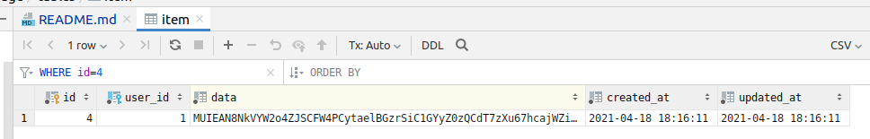

# Secure Information Storage REST API

## About

A CRUD API for securely storing strings. It uses Halite which is based on Sodium. The algorithm of encryption is xsalsa20, see `\ParagonIE\Halite\Symmetric\Crypto::encrypt`.

The principles of security are as follows:
- The only places where the sensitive data (`Item::$data`) is unencrypted is in the entry points - where we receive it from the user, and when we return it to the user;
- Sensitive data is stored encrypted;
- We never pass around sensitive (`Item::$data`) in plain-text form (as a string);
- We wrap it in a special class `HiddenString` which overrides PHP magic methods such as __toString, so that the sensitive property is not exposed in the event of the class being dumped, in exception stack traces, etc.

### Login

POST `/login`

Request JSON: 
```json
{
    "username": "john",
    "password": "maxsecure"
}
```

Response:
```json
{
    "username": "john",
    "roles": [
        "ROLE_USER"
    ]
}
```

To further use the API, pass the PHPSESSID cookie received in the response.

### Create an Item

This endpoint received an item in plain text, encrypts it and stores the encrypted version in the database.

POST `/item`

Request JSON:
```json
{"data" : "secret"}
```

Response JSON:
```json
{
    "id": 4,
    "data": "faasdasd",
    "created_at": {
        "date": "2021-04-18 18:16:11.711750",
        "timezone_type": 3,
        "timezone": "UTC"
    },
    "updated_at": {
        "date": "2021-04-18 18:16:11.712207",
        "timezone_type": 3,
        "timezone": "UTC"
    }
}
```

The item in the database:



### List Items

GET `/item`

Response:

```json
[
    {
        "id": 2,
        "data": "faasdasd",
        "created_at": {
            "date": "2021-04-18 15:44:59.000000",
            "timezone_type": 3,
            "timezone": "UTC"
        },
        "updated_at": {
            "date": "2021-04-18 15:44:59.000000",
            "timezone_type": 3,
            "timezone": "UTC"
        }
    },
    {
        "id": 4,
        "data": "faasdasd",
        "created_at": {
            "date": "2021-04-18 18:16:11.000000",
            "timezone_type": 3,
            "timezone": "UTC"
        },
        "updated_at": {
            "date": "2021-04-18 18:16:11.000000",
            "timezone_type": 3,
            "timezone": "UTC"
        }
    }
]
```

### Delete Item

POST `/item/<itemid>`

Request is in form-data form and the response is the Item JSON object.

### Update Item

PUT `/item`

Contant

### Logout

POST `/logout`

No custom response is made - you will see the default Symfony welcome HTML page.

## Setup

### Prerequisites

* Install docker
* Install docker-compose
* Add your user to the "docker" group

### Project setup

* Add `secure-storage.localhost` to your `/etc/hosts`: `127.0.0.1 secure-storage.localhost`

* Run `make init` to initialize the project

### Run tests

make tests

### API credentials

* User: john
* Password: maxsecure

### Postman requests collection

You can import all available API calls to Postman using `postman_collection.json` file
